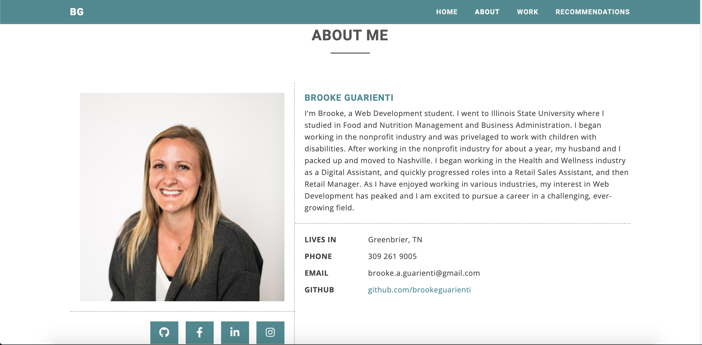

# Brooke Guarienti Portfolio
As a full stack web development student, I understand the importance of a displaying my works. You can check them out here, and, check out how I created my portfolio.

## Visit the full portfolio here:
https://brookeguarienti.github.io/BG-Portfolio/

## Technology
* HTML 
* Style CSS
* Bootstrap 
* OWL
* Font Awesome 
* Images
* JavaScript
* jQuery 

## Layout
### Header
* Header Image 
* Anchor tags in sticky header
* Anchor tags to Resume and Contact Info

### About 
* Sticky header follows throughout website with anchor tags
* Icons links:
    * GitHub Repository
    * FaceBook 
    * LinkedIn 
    * Instagram

